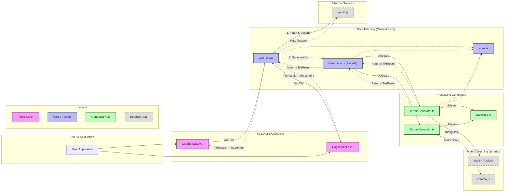

# Deck.gl-GeoTIFF Library Architecture

This diagram visualizes the high-level architecture of the `deck.gl-geotiff` library, showing how data flows from the source (COG) to the rendered `deck.gl` layer.

Use this code block in [Mermaid Live Editor](https://mermaid.live/).

## Component Roles

1.  **Layers (`CogBitmapLayer`, `CogTerrainLayer`)**:
    *   The public interface for users.
    *   Handles `deck.gl` lifecycle (updateTriggers, rendering).
    *   Instantiates `CogTiles` to manage data fetching.

2.  **`CogTiles`**:
    *   **The Librarian**. Knows how to read a COG file structure.
    *   Handles tiling logic (XYZ -> Byte Ranges).
    *   Handles "Stitching" fetch logic (fetching 257x257 pixels).
    *   Passes raw raster data to `GeoImage`.

3.  **`GeoImage` (Facade)**:
    *   **The Orchestrator**.
    *   Receives raw data from `CogTiles`.
    *   Decides whether to generate an image or a 3D mesh based on options.
    *   Delegates work to specialized generators.

4.  **`TerrainGenerator`**:
    *   Converts raw elevation data -> 3D Mesh (Vertices + Indices).
    *   Handles **Martini / Delatin** triangulation.
    *   Handles skirts and vertical exaggeration.
    *   Returns a `TileResult` where `map` is the mesh and `raw` is the source elevation `Float32Array`.

5.  **`BitmapGenerator`**:
    *   Converts raw band data -> Visual Image (RGBA).
    *   Handles **Pixel Operations** (Contrast, Heatmaps, Classification).
    *   Produces an `ImageBitmap` for the layer to display.
    *   Returns a `TileResult` where `map` is the `ImageBitmap` and `raw` is the source raster `TypedArray`.

6.  **`TileResult` (`types.ts`)**:
    *   The shared return type from all generators: `{ map, raw, width, height }`.
    *   `map` — the visual artifact (`ImageBitmap` or mesh) sent to the GPU.
    *   `raw` — the original raster/elevation data kept on the CPU (RAM).
    *   Stored in `tile.content` by deck.gl's `TileLayer`, enabling raw value picking via `onClick`/`onHover` without additional network requests.

## AbortSignal Propagation & Tile Cancellation

### How It Works

To optimize network usage with large COGs, the library uses **AbortSignal** to cancel in-flight tile requests when the viewport changes and tiles are no longer visible.

**The control flow:**

1. **Deck.gl creates an AbortSignal** for each tile and passes it via `tile.signal`
2. **Our layers pass the signal** to `CogTiles.getTile(signal)`
3. **CogTiles propagates it** to `geotiff.js` via `readRasters({ signal })`
4. **When deck.gl prunes the tile**, it calls `signal.abort()`
5. **Geotiff.js detects the abort** and throws `AbortError`
6. **We normalize abort errors** in `getTileFromImage()` by rethrowing a standard `DOMException('AbortError')`. This ensures deck.gl treats the request as a cancellation and keeps parent tiles visible as placeholders rather than leaving holes.
7. **Result**: Network request is cancelled, WebGL resources freed, and deck.gl keeps parent tiles as placeholders ✅

### Handling Deck.gl's Internal AbortErrors

When panning and zooming rapidly with large datasets, deck.gl aggressively prunes tiles from the viewport. This triggers AbortErrors in two places:

- ✅ **In geotiff.js** (caught by our try/catch)
- ❌ **In deck.gl's `Tile2DHeader.abort()`** (deck.gl's internal error handling)

**Why deck.gl's error escapes:**

Deck.gl's abort error originates outside its promise chain that has the `.catch()` handler, causing it to escape as an "Uncaught (in promise)" rejection. This is an architectural quirk in deck.gl, not a bug in our library.

**How this library handles it:**

When you import `@gisatcz/deckgl-geolib`, the library automatically registers a single global `unhandledrejection` handler that suppresses `AbortError` events. This is:

- ✅ **Automatic** — no user configuration needed
- ✅ **Safe** — only suppresses `AbortError`, not other exceptions
- ✅ **Idempotent** — registered exactly once, even with multiple imports
- ✅ **Correct** — AbortError is control flow (normal tile cancellation), not an application error

See `geoimage/src/utils/suppressAbortErrors.ts` for the implementation.
