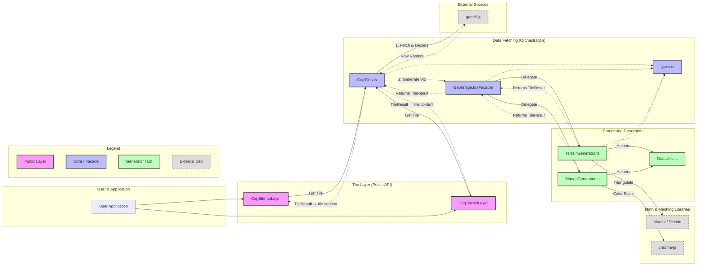

# Deck.gl-GeoTIFF Library Architecture

This diagram visualizes the high-level architecture of the `deck.gl-geotiff` library, showing how data flows from the source (COG) to the rendered `deck.gl` layer.

Use this code block in [Mermaid Live Editor](https://mermaid.live/).

## Component Roles

1.  **Layers (`CogBitmapLayer`, `CogTerrainLayer`)**:
    *   The public interface for users.
    *   Handles `deck.gl` lifecycle (updateTriggers, rendering).
    *   Instantiates `CogTiles` to manage data fetching.

2.  **`CogTiles`**:
    *   **The Librarian**. Knows how to read a COG file structure.
    *   Handles tiling logic (XYZ -> Byte Ranges).
    *   Handles "Stitching" fetch logic (fetching 257x257 pixels).
    *   Passes raw raster data to `GeoImage`.

3.  **`GeoImage` (Facade)**:
    *   **The Orchestrator**.
    *   Receives raw data from `CogTiles`.
    *   Decides whether to generate an image or a 3D mesh based on options.
    *   Delegates work to specialized generators.

4.  **`TerrainGenerator`**:
    *   Converts raw elevation data -> 3D Mesh (Vertices + Indices).
    *   Handles **Martini / Delatin** triangulation.
    *   Handles skirts and vertical exaggeration.
    *   Returns a `TileResult` where `map` is the mesh and `raw` is the source elevation `Float32Array`.

5.  **`BitmapGenerator`**:
    *   Converts raw band data -> Visual Image (RGBA).
    *   Handles **Pixel Operations** (Contrast, Heatmaps, Classification).
    *   Produces an `ImageBitmap` for the layer to display.
    *   Returns a `TileResult` where `map` is the `ImageBitmap` and `raw` is the source raster `TypedArray`.

6.  **`TileResult` (`types.ts`)**:
    *   The shared return type from all generators: `{ map, raw, width, height }`.
    *   `map` — the visual artifact (`ImageBitmap` or mesh) sent to the GPU.
    *   `raw` — the original raster/elevation data kept on the CPU (RAM).
    *   Stored in `tile.content` by deck.gl's `TileLayer`, enabling raw value picking via `onClick`/`onHover` without additional network requests.
