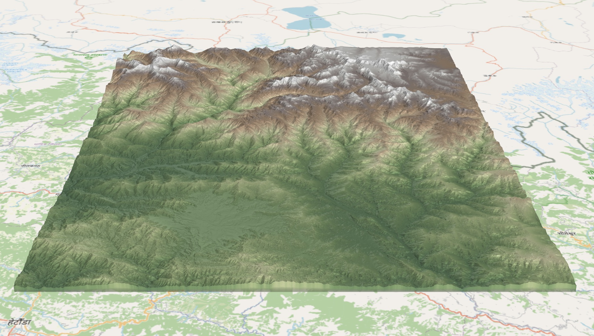
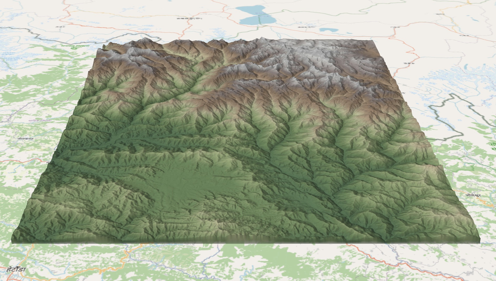
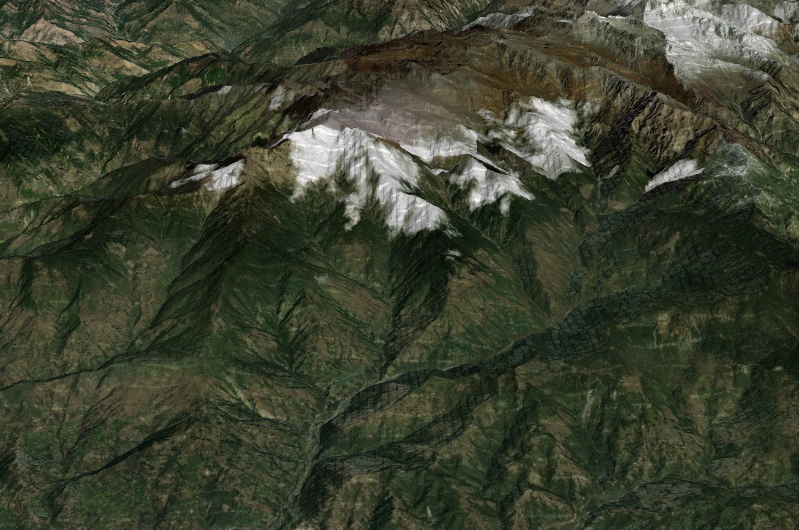
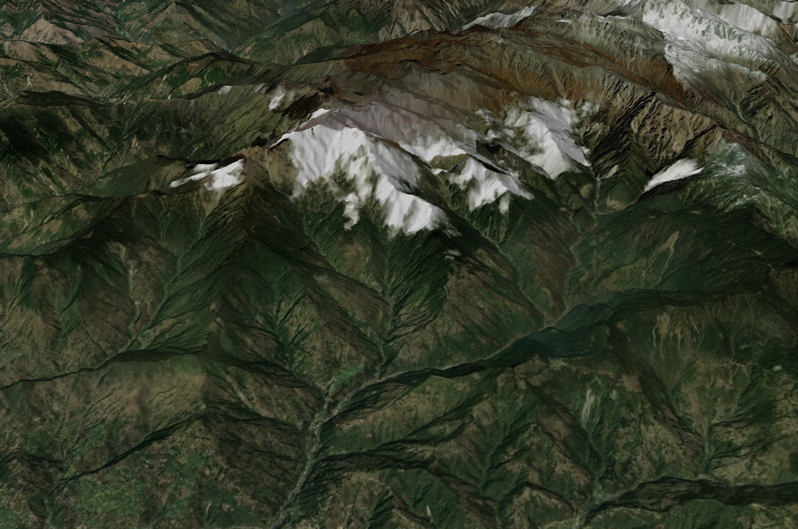

# Layer Showcase

This guide demonstrates the core visual capabilities of `@gisatcz/deckgl-geolib`. 
For detailed API properties, please refer to the [API Reference](api-reference.md).

## Setup

```typescript
import { CogBitmapLayer, CogTerrainLayer } from '@gisatcz/deckgl-geolib';
```

---

## 1. Satellite Imagery (RGB)

**Use Case:** rendering standard multi-band satellite or aerial imagery (True Color). 
The `CogBitmapLayer` automatically detects RGB channels.


```typescript
const satelliteLayer = new CogBitmapLayer({
  id: 'satellite-rgb',
  rasterData: 'https://example.com/satellite-imagery.tif',
  isTiled: true,
  cogBitmapOptions: {
    type: 'image',
    // Optional: Enhance visuals
    // blurredTexture: true (default) for smooth interpolated pixels
  }
});
```

---

## 2. Thematic Analysis (Heatmaps & Classification)

**Use Case:** visualizing scientific data (e.g., NDVI, temperature, elevation benchmarks) using heatmaps or categorical coloring.

### A. Heatmaps
Convert a single channel of data into a visualized heatmap.


```typescript
const heatmapLayer = new CogBitmapLayer({
  id: 'heatmap',
  rasterData: 'https://example.com/heatmap.tif',
  isTiled: true,
  cogBitmapOptions: {
    type: 'image',
    useChannel: 1,
    useHeatMap: true,
    colorScaleValueRange: [100, 300],
    colorScale: ['yellow', '#20908d', [68, 1, 84]]
  }
});
```

### B. Data Clipping
Highlight specific values (e.g., "Show me values between 100–200 in green").


```typescript
const analysisLayer = new CogBitmapLayer({
  id: 'analysis-clip',
  rasterData: 'https://example.com/analysis.tif',
  isTiled: true,
  cogBitmapOptions: {
    type: 'image',
    useChannel: 1,
    useSingleColor: true,
    color: [32, 144, 81, 255], // Green
    clipLow: 100, 
    clipHigh: 200,
    clippedColor: 'yellow' // Yellow for values outside range
  }
});
```

### C. Categorical Classification
Assign specific colors to exact data values (e.g., Land Cover classes).


```typescript
const categoricalLayer = new CogBitmapLayer({
  id: 'categorical-layer',
  rasterData: 'https://example.com/landcover.tif',
  isTiled: true,
  cogBitmapOptions: {
    type: 'image',
    useChannel: 1,
    useColorsBasedOnValues: true,
    colorsBasedOnValues: [
      [10, 'red'],           // Class 1 (Red)
      [20, [0, 0, 255]],     // Class 2 (Blue)
      [30, '#00FF00']        // Class 3 (Green)
    ]
  }
});
```

### D. Interval Classes
Assign colors to data ranges (e.g. elevation zones or risk levels).


```typescript
const intervalLayer = new CogBitmapLayer({
  id: 'interval-layer',
  rasterData: 'https://example.com/data.tif',
  isTiled: true,
  cogBitmapOptions: {
    type: 'image',
    useChannel: 1,
    useColorClasses: true,
    colorClasses: [
      ['#fde725', [0, 1000]],     // Range 0 - 1000
      ['#5dc962', [1000, 2000]],  // Range 1000 - 2000
      ['#20908d', [2000, 4000]]   // Range 2000 - 4000
    ]
  }
});
```

---

## 3. 3D Terrain & Draping

**Use Case:** rendering 3D landscapes from Digital Elevation Models (DEM) and draping satellite imagery over them.

### A. Basic Terrain
Render a 3D mesh from elevation data.


```typescript
const terrainLayer = new CogTerrainLayer({
  id: 'terrain-layer',
  elevationData: 'https://example.com/dem.tif',
  isTiled: true,
  tileSize: 256,
  meshMaxError: 4.0, // Martini error tolerance in meters, smaller number -> more detailed mesh, (default 4.0)
  operation: 'terrain+draw',
  terrainOptions: {
    type: 'terrain',
    useSingleColor: true,
    multiplier: 1.0, // Vertical exaggeration
    terrainSkirtHeight: 100 // Hides gaps between tiles
  }
});
```

### B. Terrain with Draping (External Texture)
Project a satellite image or tile service (XYZ) onto the 3D terrain.


```typescript
const drapedLayer = new CogTerrainLayer({
  id: 'terrain-draped',
  elevationData: 'https://example.com/dem.tif',
  texture: 'https://site.com/satellite/{z}/{x}/{y}.png', // XYZ Service
  isTiled: true,
  tileSize: 256,
  operation: 'terrain+draw',
  terrainOptions: {
    type: 'terrain',
  }
});
```

### C. Terrain with Stylized Overlay

Render the terrain with a color visualization derived from the elevation data itself — no separate layer needed. Pass visualization options directly in `terrainOptions` and `CogTerrainLayer` will automatically generate and drape the texture.


```typescript
const terrainLayer = new CogTerrainLayer({
  id: 'terrain-layer',
  elevationData: 'https://example.com/dem.tif',
  isTiled: true,
  tileSize: 256,
  operation: 'terrain+draw',
  terrainOptions: {
    type: 'terrain',
    useHeatMap: true,
    useChannel: 1,
    colorScale: ['#fde725', '#5dc962', '#20908d', '#3a528b', '#440154'],
    colorScaleValueRange: [-100, 9000],
  }
});
```

> **Need a texture from a different COG?** If your overlay data comes from a separate file, use a `CogBitmapLayer` with `clampToTerrain: true` as before:
>
> ```typescript
> // Terrain mesh
> const terrainLayer = new CogTerrainLayer({ ... });
>
> // Overlay from a different source
> const heatmapOverlay = new CogBitmapLayer({
>   id: 'heatmap-overlay',
>   rasterData: 'https://example.com/other-data.tif',
>   isTiled: true,
>   clampToTerrain: true,
>   cogBitmapOptions: {
>     type: 'image',
>     useHeatMap: true,
>     colorScaleValueRange: [-100, 9000],
>   }
> });
> ```

### D. Terrain with Kernel Analysis (Slope & Hillshade)

Compute and visualize slope or hillshade directly from the elevation data using a 3×3 kernel. The derived surface is draped as a texture over the 3D mesh. Both elevation and the derived value are available for picking simultaneously via `TileResult.raw` and `TileResult.rawDerived`.


**Static visualization** (single mode, no switching):

```typescript
const slopeLayer = new CogTerrainLayer({
  id: 'terrain-slope',
  elevationData: 'https://example.com/dem.tif',
  isTiled: true,
  tileSize: 256,
  operation: 'terrain+draw',
  terrainOptions: {
    type: 'terrain',
    useChannel: 1,
    noDataValue: 0,
    useSlope: true,           // or useHillshade: true
    useHeatMap: true,
    colorScale: [[255, 255, 255], [235, 200, 150], [200, 80, 50], [100, 40, 30]],
    colorScaleValueRange: [0, 90], // degrees
  },
  pickable: true,
});
```

**Dynamic mode switching** (elevation / slope / hillshade toggle):

Each mode requires a different `CogTiles` instance (different fetch size and kernel logic). Pass it via the `cogTiles` prop — when the prop changes, `CogTerrainLayer` detects it and refetches tiles while keeping the previous tile content visible during the transition.

```tsx
import { useState, useEffect, useMemo } from 'react';
import { CogTerrainLayer, CogTiles } from '@gisatcz/deckgl-geolib';

type Mode = 'elevation' | 'slope' | 'hillshade';

const modeOptions: Record<Mode, object> = {
  elevation: { useHeatMap: true, colorScale: ['green', 'yellow', 'white'], colorScaleValueRange: [0, 6000] },
  slope:     { useSlope: true, useHeatMap: true, colorScale: [[255,255,255],[120,70,30],[60,20,10]], colorScaleValueRange: [0, 60] },
  hillshade: { useHillshade: true, useHeatMap: true, colorScale: [[52,38,35],[255,250,245]], colorScaleValueRange: [0, 255] },
};

function buildOptions(mode: Mode) {
  return { type: 'terrain' as const, useChannel: 1, noDataValue: 0, ...modeOptions[mode] };
}

function MyMap() {
  const [mode, setMode] = useState<Mode>('elevation');
  // cogState pairs CogTiles with the mode it was built for.
  // Keeping mode alongside CogTiles ensures terrainOptions always matches what CogTiles fetches.
  const [cogState, setCogState] = useState<{ cog: CogTiles; mode: Mode } | null>(null);

  useEffect(() => {
    const cog = new CogTiles(buildOptions(mode));
    cog.initializeCog('https://example.com/dem.tif').then(() => {
      setCogState({ cog, mode });
    });
  }, [mode]);

  const layers = useMemo(() => {
    if (!cogState) return [];
    return [
      new CogTerrainLayer({
        id: 'terrain-kernel',            // stable id — deck.gl keeps tile content during refetch
        elevationData: 'https://example.com/dem.tif',
        cogTiles: cogState.cog,
        isTiled: true,
        tileSize: 256,
        operation: 'terrain+draw',
        terrainOptions: buildOptions(cogState.mode), // use cogState.mode, not mode
        pickable: true,
      }),
    ];
  }, [cogState]);

  return <DeckGL layers={layers} /* ... */ />;
}
```

> **Why stable layer id?** Using the same id (`'terrain-kernel'`) across mode changes tells deck.gl to update the existing layer rather than destroy and recreate it. This preserves the tile cache, so old tiles remain visible until new ones arrive — no white canvas flash.

> **Why `cogState.mode` not `mode`?** After clicking a new mode, `mode` updates immediately but `cogState` still holds the old `CogTiles`. Using `cogState.mode` for `terrainOptions` ensures the visualization options always match the `CogTiles` instance that is actually fetching — preventing a mismatch between heatmap options and kernel fetch size.

**Picking slope + elevation simultaneously:**

```typescript
getTooltip={(info) => {
  const tileResult = info.tile?.content?.[0];
  if (!tileResult?.raw) return null;

  const { raw, rawDerived, width, height } = tileResult;
  const { west, south, east, north } = info.tile.bbox;
  const u = (info.coordinate[0] - west) / (east - west);
  const v = (north - info.coordinate[1]) / (north - south);

  const x = Math.min(width - 1, Math.max(0, Math.floor(u * (width - 1))));
  const y = Math.min(height - 1, Math.max(0, Math.floor(v * (height - 1))));
  const elevation = raw[y * width + x];

  const kx = Math.min(255, Math.max(0, Math.floor(u * 255)));
  const ky = Math.min(255, Math.max(0, Math.floor(v * 255)));
  const slope = rawDerived?.[ky * 256 + kx];

  return { text: [`Elevation: ${elevation.toFixed(1)} m`, slope != null ? `Slope: ${slope.toFixed(1)}°` : ''].join('\n') };
}}
```

> **Hillshade variant:** replace `useSlope: true` with `useHillshade: true` and set `colorScale: [[52, 38, 35], [255, 250, 245]]` with `colorScaleValueRange: [0, 255]`. Optionally set `hillshadeAzimuth` (default `315`) and `hillshadeAltitude` (default `45`) to control the sun position.

---

## 3.4 Swiss Relief Shading (Baked Mode)

**Use Case:** Combining hypsometric color, hillshade, and slope into a single terrain texture for superior relief perception. The Swiss relief formula produces a natural, cartography-quality shading effect without visible Z-fighting.

<div style="display: flex; gap: 12px; align-items: flex-start;">
  
  
</div>

*Left: Standard terrain with default lighting. Right: Terrain with Swiss relief shading baked into the texture.*

This example shows a single `CogTerrainLayer` with relief shading baked directly into the terrain texture using hypsometric color scales.

```typescript
const swissReliefTerrainLayer = new CogTerrainLayer({
  id: 'swiss-relief-baked',
  elevationData: 'https://example.com/dem.tif',
  isTiled: true,
  cogTiles: demCogTiles,
  tileSize: 256,
  terrainOptions: {
    type: 'terrain',
    useSwissRelief: true,
    useHeatMap: true,
    colorScale: [
      [20, 30, 40],      // Deep blue (water/low)
      [34, 139, 34],     // Forest green (foothills)
      [139, 90, 43],     // Brown (slopes)
      [192, 192, 192],   // Gray (rocky peaks)
      [255, 255, 255]    // White (snow/high)
    ],
    colorScaleValueRange: [0, 6500],
    swissSlopeWeight: 0.5,  // Balance between slope and hillshade (0.3–1.0)
    zFactor: 20,            // Vertical exaggeration for better depth perception
    noDataValue: 0,
    useChannel: 1,
  },
  operation: 'terrain+draw',
  pickable: true,
});
```

**Key parameters:**
- `useSwissRelief: true` — Enables Swiss relief compositing (slope + hillshade blending).
- `colorScale` — Hypsometric color palette mapped to elevation values.
- `swissSlopeWeight` — Controls the influence of slope on the final appearance (lower = more hillshade, higher = more slope contrast).
- `zFactor` — Vertical exaggeration factor (affects slope steepness calculation, typically 1–30).

> **Performance Note:** The Swiss relief computation uses a pre-computed LUT and kernel operations to combine slope and hillshade at 65,536 pixels per tile. Automatic lighting is disabled when `useSwissRelief: true` to avoid visual conflicts.

---

## 3.5 Swiss Relief Shading (Glaze Mode – Layer Sandwich)

**Use Case:** Overlaying transparent Swiss relief shading on top of satellite or OSM imagery, combined with a terrain mesh. Perfect for adding 3D relief perception to any base map without replacing it.

<div style="display: flex; gap: 12px; align-items: flex-start;">
  
  
</div>

*Left: Satellite imagery with standard lighting. Right: Swiss relief glaze overlay (sandwich approach) adds 3D relief perception without obscuring the base map.*

This example demonstrates the "Sandwich" architecture:
1. **Bottom layer**: Terrain mesh (`CogTerrainLayer` with no texture).
2. **Middle layer**: Base map imagery (`TileLayer` – satellite or OSM).
3. **Top layer**: Transparent glaze overlay (`CogBitmapLayer` with `useReliefGlaze: true`).

```typescript
// Layer 1: Base terrain mesh (geometry only, no texture)
const terrainLayer = new CogTerrainLayer({
  id: 'terrain-geometry',
  elevationData: 'https://example.com/dem.tif',
  isTiled: true,
  tileSize: 256,
  operation: 'terrain',  // Render mesh only, no texture
  terrainOptions: {
    type: 'terrain',
    disableLighting: true,
    useSingleColor: true,
    noDataValue: 0,
    useChannel: 1,
  },
});

// Layer 2: Satellite or OSM base map
const satelliteLayer = new TileLayer({
  data: 'https://server.arcgisonline.com/ArcGIS/rest/services/World_Imagery/MapServer/tile/{z}/{y}/{x}',
  id: 'satellite-base',
  minZoom: 0,
  maxZoom: 19,
  tileSize: 256,
  extensions: [new TerrainExtension()],
  renderSubLayers: (props) => {
    const { bbox } = props.tile;
    const { west, south, east, north } = bbox;
    return new BitmapLayer(props, {
      data: undefined,
      image: props.data,
      bounds: [west, south, east, north],
    });
  },
});

// Layer 3: Swiss relief glaze overlay (transparent, variable alpha)
const glazeLayer = new CogBitmapLayer({
  id: 'relief-glaze-overlay',
  rasterData: 'https://example.com/dem.tif',
  isTiled: true,
  tileSize: 256,
  clampToTerrain: true,
  extensions: [new TerrainExtension()],
  cogBitmapOptions: {
    type: 'image',
    useReliefGlaze: true,
    noDataValue: 0,
    swissSlopeWeight: 0.3,       // Slope contribution (0.2–0.5 recommended for overlays)
    zFactor: 20,                 // Vertical exaggeration
    maxGlazeAlpha: 130,          // 0–255 intensity ceiling; 120–160 recommended for overlays
    useChannel: 1,
  },
});

// Render layers in order: terrain → satellite → glaze
const layers = [terrainLayer, satelliteLayer, glazeLayer];
```

**Key parameters for glaze mode:**
- `useReliefGlaze: true` — Enables relief glaze computation (pure black/white overlays with variable alpha).
- `maxGlazeAlpha` — Intensity ceiling (0–255). Controls how opaque the glaze can be at extreme slope/aspect values. Recommended range: 120–160 for balanced overlays.
- `swissSlopeWeight` — Slope influence on glaze appearance (0.2–0.5 for natural-looking overlays; higher values emphasize slope contrast).
- `clampToTerrain: true` — Ensures the glaze layer correctly follows the terrain mesh surface.

**Advantages of Glaze Mode:**
- Preserves satellite/OSM imagery detail (no color replacement).
- Zero Z-fighting or flickering.
- Flexible: swap satellite for OSM, add vector overlays, etc.
- Per-pixel variable alpha prevents muddy neutral-gray regions.

---

## 3.6 Overlay Tiles with Proper 3D Frustum Culling

**Use Case:** rendering standard XYZ tile providers (OSM, satellite imagery, map tiles) as overlays on top of 3D terrain without foreground tile clipping when the viewport is tilted.

### The Problem: Tile Clipping in 3D

When rendering overlay `TileLayer` (OSM, Satellite, etc.) over elevated terrain with a tilted camera, foreground tiles may be incorrectly culled or clipped. This happens because deck.gl's `TileLayer` assumes tiles exist on a flat Z=0 plane by default. When the viewport is tilted in 3D and the terrain is elevated, the frustum culling math fails to account for the terrain's elevation range.

### The Solution: Sync `zRange` from CogTerrainLayer

Pass the elevation range (`zRange`) from your `CogTerrainLayer` to the overlay `TileLayer`. This tells deck.gl's frustum culling algorithm: *"these tiles exist between minZ and maxZ elevations, not just at Z=0."*

#### Example: OSM Overlay on Terrain (Using Hook)

The easiest way to integrate is with the `useTerrainZRange` hook:

```typescript
import { CogTerrainLayer } from '@gisatcz/deckgl-geolib';
import { useTerrainZRange } from '@gisatcz/deckgl-geolib/react';
import { TileLayer } from '@deck.gl/geo-layers';
import { BitmapLayer } from '@deck.gl/layers';
import React, { useMemo } from 'react';

function TerrainWithOSM() {
  // 1. Use the hook
  const { zRange, onZRangeUpdate } = useTerrainZRange();

  const layers = useMemo(() => [
    // OSM overlay with zRange for proper 3D culling
    new TileLayer({
      id: 'osm-overlay',
      data: 'https://c.tile.openstreetmap.org/{z}/{x}/{y}.png',
      minZoom: 0,
      maxZoom: 19,
      tileSize: 256,
      zRange: zRange,  // ← 2. Pass elevation bounds from hook
      renderSubLayers: (props) => {
        const { bbox } = props.tile as any;
        const { west, south, east, north } = bbox;
        return new BitmapLayer(props, {
          data: undefined,
          image: props.data,
          bounds: [west, south, east, north],
        });
      },
    }),
    // Terrain layer that computes and updates zRange
    new CogTerrainLayer({
      id: 'terrain',
      elevationData: 'https://example.com/dem.tif',
      isTiled: true,
      tileSize: 256,
      terrainOptions: { type: 'terrain' },
      onZRangeUpdate: onZRangeUpdate,  // ← 3. Sync elevation bounds to hook
    }),
  ], [zRange]);

  return <DeckGL layers={layers} /* ... */ />;
}
```

**That's it!** 3 lines: import hook, call hook, wire to layers.

#### Alternative: Manual State Management

If you prefer full control, you can manage the state manually:

```typescript
import { CogTerrainLayer } from '@gisatcz/deckgl-geolib';
import { TileLayer } from '@deck.gl/geo-layers';
import { BitmapLayer } from '@deck.gl/layers';
import React, { useState, useMemo } from 'react';

function TerrainWithOSM() {
  const [terrainZRange, setTerrainZRange] = useState<[number, number] | null>(null);

  const layers = useMemo(() => [
    new TileLayer({
      id: 'osm-overlay',
      data: 'https://c.tile.openstreetmap.org/{z}/{x}/{y}.png',
      minZoom: 0,
      maxZoom: 19,
      tileSize: 256,
      zRange: terrainZRange,  // ← Pass elevation bounds
      renderSubLayers: (props) => {
        const { bbox } = props.tile as any;
        const { west, south, east, north } = bbox;
        return new BitmapLayer(props, {
          data: undefined,
          image: props.data,
          bounds: [west, south, east, north],
        });
      },
    }),
    new CogTerrainLayer({
      id: 'terrain',
      elevationData: 'https://example.com/dem.tif',
      isTiled: true,
      tileSize: 256,
      terrainOptions: { type: 'terrain' },
      onZRangeUpdate: setTerrainZRange,  // ← Receive zRange updates
    }),
  ], [terrainZRange]);

  return <DeckGL layers={layers} /* ... */ />;
}
```

#### How It Works

1. **Terrain Layer computes elevation bounds** — As `CogTerrainLayer` loads terrain tiles, it calculates the min/max elevation (`zRange`) from the loaded mesh data.
2. **Callback fires on update** — When terrain tiles load and the elevation bounds expand, `onZRangeUpdate` callback fires with the updated `zRange`.
3. **Overlay receives bounds** — React state syncs the `zRange` into the overlay `TileLayer`.
4. **Frustum culling corrected** — deck.gl now knows the elevation range and performs correct 3D frustum culling, keeping foreground tiles visible even when tilted.

#### Key Props

| Layer | Prop | Type | Purpose |
|---|---|---|---|
| **CogTerrainLayer** | `onZRangeUpdate` | `(zRange: [number, number] \| null) => void` | Callback fired when terrain elevation bounds are updated |
| **TileLayer** | `zRange` | `[number, number] \| null` | Elevation range for 3D frustum culling |

#### Result

✅ **Before tilt:** All tiles visible (no regression)  
✅ **During tilt:** Foreground tiles remain fully loaded and rendered  
✅ **3D rotation:** Complete tile coverage regardless of camera angle  

### Technical Details

deck.gl's `TileLayer` uses `zRange` to expand its 3D bounding volume when performing frustum culling. Without `zRange`, tiles are assumed to exist only on the Z=0 plane. When the camera is tilted and looking at elevated terrain, tiles that are "below" the Z=0 plane in screen space (but actually visible on the terrain surface) are incorrectly culled.

By passing the terrain's elevation bounds via `zRange`, the tile layer's bounding box expands to `[west, south, east, north, minZ, maxZ]` (in lon/lat/elevation order), ensuring correct intersection testing with the camera frustum.

#### Important Notes

- **Dynamic updates:** `zRange` updates progressively as terrain tiles load. The overlay will automatically adjust visibility as the terrain elevation range expands.
- **Multiple overlay layers:** Apply this pattern to each overlay layer (OSM, satellite, etc.) if you have multiple overlays stacked on the same terrain.
- **No performance penalty:** Passing `zRange` does not affect rendering performance — it only improves frustum culling accuracy.
- **Compatible with `TerrainExtension`:** This pattern works whether or not your overlay layers use the `TerrainExtension`.

---

## 4. Raw Value Picking

**Use Case:** retrieving the original GeoTIFF raster values (elevation, band values, indices) at a clicked location, without extra network requests.

### A. Bitmap Picking (2D scene)

For flat imagery without terrain, `CogBitmapLayer` provides 2D coordinates and UV texture coordinates:

```typescript
const layer = new CogBitmapLayer({
  id: 'picking-bitmap',
  rasterData: 'https://example.com/data.tif',
  isTiled: true,
  pickable: true, // 2D picking is sufficient for flat imagery
  onClick: (info) => {
    if (info.tile?.content?.raw) {
      // UV can be in info.uv or info.bitmap.uv depending on layer configuration
      const uv = info.uv || (info.bitmap && info.bitmap.uv);
      if (uv) {
        const { raw, width, height } = info.tile.content;
        const [u, v] = uv;
        const x = Math.floor(u * width);
        const y = Math.floor(v * height);
        const channels = raw.length / (width * height);
        const pixelIndex = Math.floor((y * width + x) * channels);
        const rawValues = raw.slice(pixelIndex, pixelIndex + channels);
        console.log('Raw values:', rawValues); // e.g. [128, 200, 45] for 3 bands
      }
    }
  }
});
```

### B. Terrain Picking (3D scene)

For terrain meshes, use `pickable: '3d'` to get true 3D coordinates **clamped to the terrain surface**. This works accurately at any camera pitch:

#### Simple Approach (Recommended)

Use the `extractTerrainCoordinate()` utility:

```typescript
import { CogTerrainLayer, extractTerrainCoordinate } from '@gisatcz/deckgl-geolib';

const layer = new CogTerrainLayer({
  id: 'picking-terrain',
  elevationData: 'https://example.com/dem.tif',
  isTiled: true,
  pickable: '3d',  // ← Enable 3D picking (returns 3-element coordinate on terrain surface)
  operation: 'terrain+draw',
  terrainOptions: { type: 'terrain' },
  onClick: (info) => {
    const coord = extractTerrainCoordinate(info);
    if (coord) {
      console.log(`Lat: ${coord.latitude.toFixed(6)}, Lon: ${coord.longitude.toFixed(6)}, Elev: ${coord.elevation.toFixed(2)}m`);
    }
  }
});
```

#### Advanced: Access Raw Raster Values

To query elevation or additional bands from the raster:

```typescript
import { CogTerrainLayer, extractTerrainCoordinate } from '@gisatcz/deckgl-geolib';

const layer = new CogTerrainLayer({
  id: 'picking-terrain',
  elevationData: 'https://example.com/dem.tif',
  isTiled: true,
  pickable: '3d',  // ← Enable 3D picking
  operation: 'terrain+draw',
  terrainOptions: { type: 'terrain' },
  onClick: (info) => {
    const coord = extractTerrainCoordinate(info);
    if (!coord) return;

    const tileResult = info.tile?.content?.[0];
    if (!tileResult?.raw) return;

    const bbox = info.tile.bbox;
    const { west, south, east, north } = bbox;

    // Map 3D coordinate to raster pixel
    const u = (coord.longitude - west) / (east - west);
    const v = (north - coord.latitude) / (north - south);
    const pixelX = Math.round(Math.max(0, Math.min(1, u)) * (tileResult.width - 1));
    const pixelY = Math.round(Math.max(0, Math.min(1, v)) * (tileResult.height - 1));

    // Query elevation and other bands
    const elevation = tileResult.raw[pixelY * tileResult.width + pixelX];
    const channels = tileResult.raw.length / (tileResult.width * tileResult.height);
    const pixelOffset = (pixelY * tileResult.width + pixelX) * channels;
    const allBands = Array.from(tileResult.raw.slice(pixelOffset, pixelOffset + channels));
    
    console.log('Elevation:', elevation);
    console.log('All bands:', allBands);
  }
});
```

**Key Difference from `pickable: true`:**
- `pickable: true` — Returns approximate 2D coordinates with camera parallax (incorrect at non-zero pitch)
- `pickable: '3d'` — Returns exact 3D coordinates clamped to terrain mesh (correct at any pitch)

---

## Time-Series Animation Example

**Use Case:** Render multi-temporal elevation data (e.g., 30 daily models stacked in a COG) and smoothly animate through them with a slider.

**Key Features:**
- Lazy-load pattern: user clicks "Fetch All Bands" button
- Global cache stores all bands after first fetch
- Slider instantly switches between cached bands (zero network latency)
- Works on large datasets (30+ bands)

### Setup

```tsx
import React, { useMemo, useState, useEffect } from 'react';
import DeckGL from '@deck.gl/react';
import { MapView } from '@deck.gl/core';
import { CogTerrainLayer, CogTiles } from '@gisatcz/deckgl-geolib';

const MULTIBAND_COG_URL = 'https://example.com/elevation-time-series-30-days.tif';

function TimeSeriesAnimationExample() {
  const [viewState, setViewState] = useState({
    longitude: -66.33,
    latitude: -17.09,
    zoom: 12,
  });

  // 1. Slider state (0-based index)
  const [currentBandIndex, setCurrentBandIndex] = useState(0);

  // 2. Caching state (lazy-load pattern)
  const [isFetched, setIsFetched] = useState(false);

  // 3. Pre-initialize CogTiles to read band count
  const [cogInstance, setCogInstance] = useState(null);
  useEffect(() => {
    if (!cogInstance) {
      const cog = new CogTiles({
        type: 'terrain',
        noDataValue: -32768.0,
        terrainSkirtHeight: 0,
        useChannel: 1,
        meshMaxError: 650,
        color: [0, 105, 148, 180],
        cacheAllBands: false, // Start false; enable on button click
      });

      cog.initializeCog(MULTIBAND_COG_URL).then(() => {
        setCogInstance(cog);
      });
    }
  }, []);

  const totalBands = cogInstance?.getNumChannels?.() || 30;

  const layers = useMemo(() => {
    return [
      new CogTerrainLayer({
        id: 'time-series-terrain',
        elevationData: MULTIBAND_COG_URL,
        isTiled: true,
        tileSize: 256,
        cogTiles: cogInstance || undefined,
        terrainOptions: {
          type: 'terrain',
          noDataValue: -32768.0,
          terrainSkirtHeight: 0,
          useChannel: currentBandIndex + 1, // 1-based
          meshMaxError: 650,
          useSingleColor: true,
          color: [0, 105, 148, 180],
          cacheAllBands: isFetched, // Dynamic: only cache after button click
        },
        updateTriggers: {
          getTileData: [currentBandIndex, isFetched],
        },
      }),
    ];
  }, [currentBandIndex, cogInstance, isFetched]);

  return (
    <div style={{ width: '100%', height: '100vh', position: 'relative' }}>
      <DeckGL
        viewState={viewState}
        onViewStateChange={({ viewState: v }) => setViewState(v)}
        controller
        layers={layers}
        views={[new MapView({ controller: true })]}
        style={{ position: 'absolute', top: 0, left: 0, width: '100%', height: '100%' }}
      />

      {/* Control Panel */}
      <div
        style={{
          position: 'absolute',
          bottom: 20,
          left: 20,
          background: 'rgba(255, 255, 255, 0.95)',
          padding: '16px',
          borderRadius: '8px',
          boxShadow: '0 2px 8px rgba(0, 0, 0, 0.15)',
          fontFamily: 'system-ui, sans-serif',
          fontSize: '14px',
          color: '#333',
          width: '260px',
          zIndex: 1000,
        }}
      >
        <div style={{ marginBottom: '16px', fontWeight: 'bold', fontSize: '16px' }}>
          Time-Series Terrain
        </div>

        {/* Fetch All Bands Button */}
        <button
          onClick={() => setIsFetched(true)}
          disabled={isFetched}
          style={{
            width: '100%',
            padding: '8px',
            marginBottom: '12px',
            backgroundColor: isFetched ? '#e0e0e0' : '#4CAF50',
            color: isFetched ? '#999' : 'white',
            border: 'none',
            borderRadius: '4px',
            fontWeight: '500',
            cursor: isFetched ? 'default' : 'pointer',
            transition: 'all 0.3s ease',
          }}
        >
          {isFetched ? '✅ All Bands Cached' : '⬇️ Fetch All Bands (~10 MB)'}
        </button>

        {/* Slider */}
        <div style={{ marginBottom: '12px' }}>
          <div style={{ marginBottom: '8px', fontSize: '13px', fontWeight: '500' }}>
            Day: {currentBandIndex + 1} / {totalBands}
          </div>
          <input
            type="range"
            min={0}
            max={totalBands - 1}
            value={currentBandIndex}
            disabled={!isFetched}
            onChange={(e) => setCurrentBandIndex(parseInt(e.target.value, 10))}
            onMouseUp={(e) => setCurrentBandIndex(parseInt(e.currentTarget.value, 10))}
            onTouchEnd={(e) => setCurrentBandIndex(parseInt(e.currentTarget.value, 10))}
            style={{
              width: '100%',
              cursor: isFetched ? 'pointer' : 'not-allowed',
              opacity: isFetched ? 1 : 0.5,
            }}
          />
        </div>

        {/* Help Text */}
        <div style={{ fontSize: '12px', color: '#666', marginTop: '10px', lineHeight: '1.4' }}>
          {!isFetched ? (
            <>
              💡 Click "Fetch All Bands" to cache 30 days of elevation data. Then use the slider for smooth animation.
            </>
          ) : (
            <>
              ✅ Move the slider for instant animation! Each day is cached and instantly served from memory.
            </>
          )}
        </div>
      </div>
    </div>
  );
}

export default TimeSeriesAnimationExample;
```

### Result

**Before clicking "Fetch All Bands":**
- Map shows day 1 instantly
- Slider is disabled
- No network overhead

**After clicking "Fetch All Bands":**
- Takes 3–5 seconds to fetch all 30 days
- Slider enables
- Moving slider is instant (no network latency)
- Each day is served from the global cache

### Performance

| Metric | Single-Band Mode | Multi-Band Cache |
|---|---|---|
| Initial load | < 1 sec (1 band) | 3–5 sec (all 30 bands) |
| Per slider move (no cache) | 0.5–2 sec (network) | N/A |
| Per slider move (cached) | N/A | < 50 ms (memory) |
| Memory per tile | 256 KB | 7.7 MB |
| Total for 4 tiles | 1 MB | ~31 MB |

### See Also

- [Animation Guide](animation-guide.md) — Full details on configuration and troubleshooting
- [API Reference: cacheAllBands](api-reference.md#animation--caching-options)
- [Example: CogAnimationExample.tsx in the example app](../../example/src/examples/CogAnimationExample.tsx)
